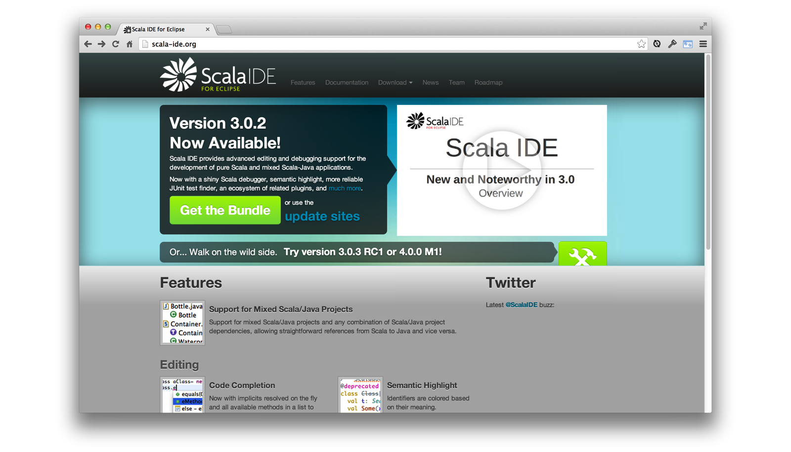
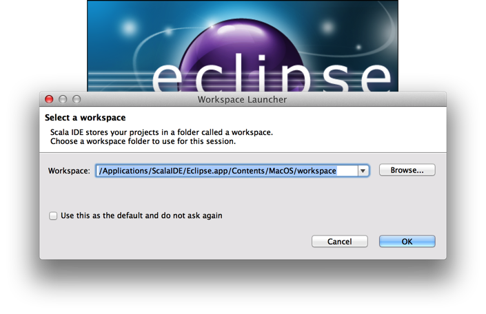
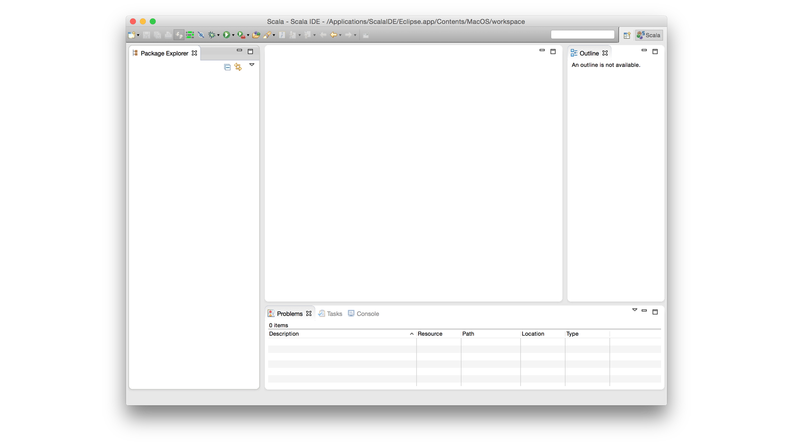
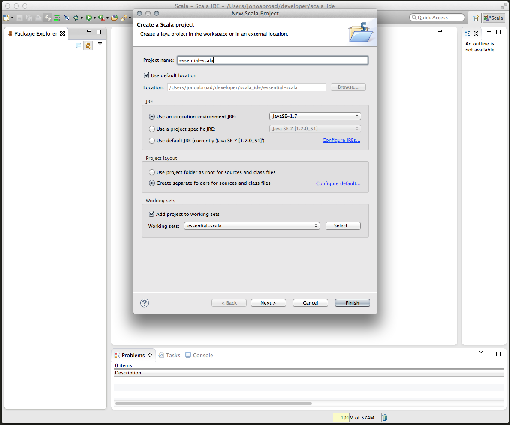
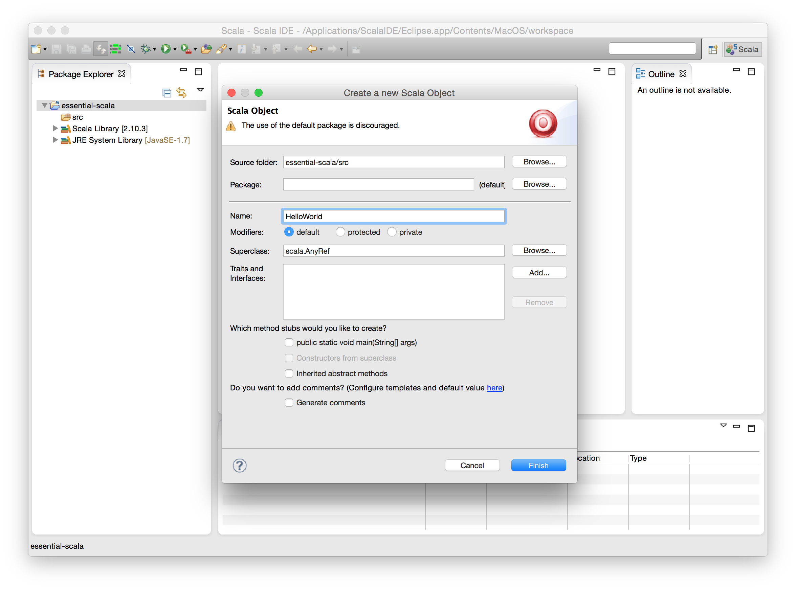
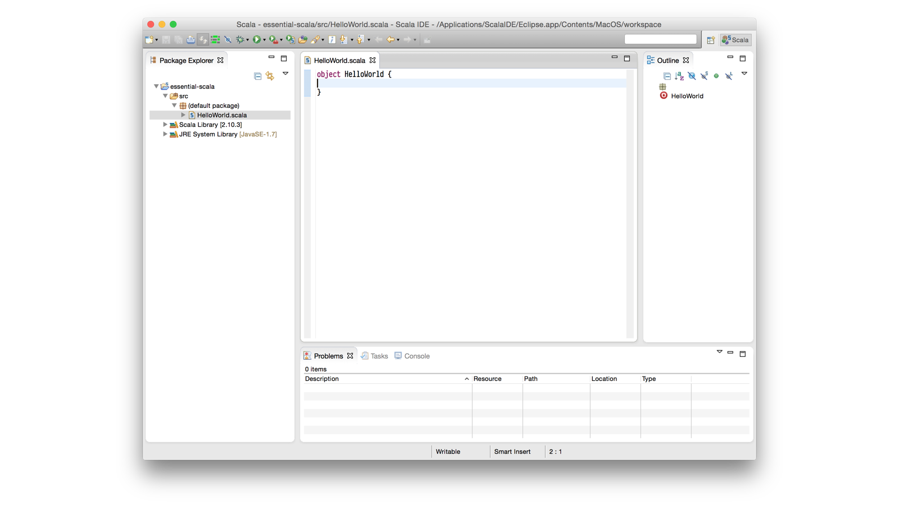
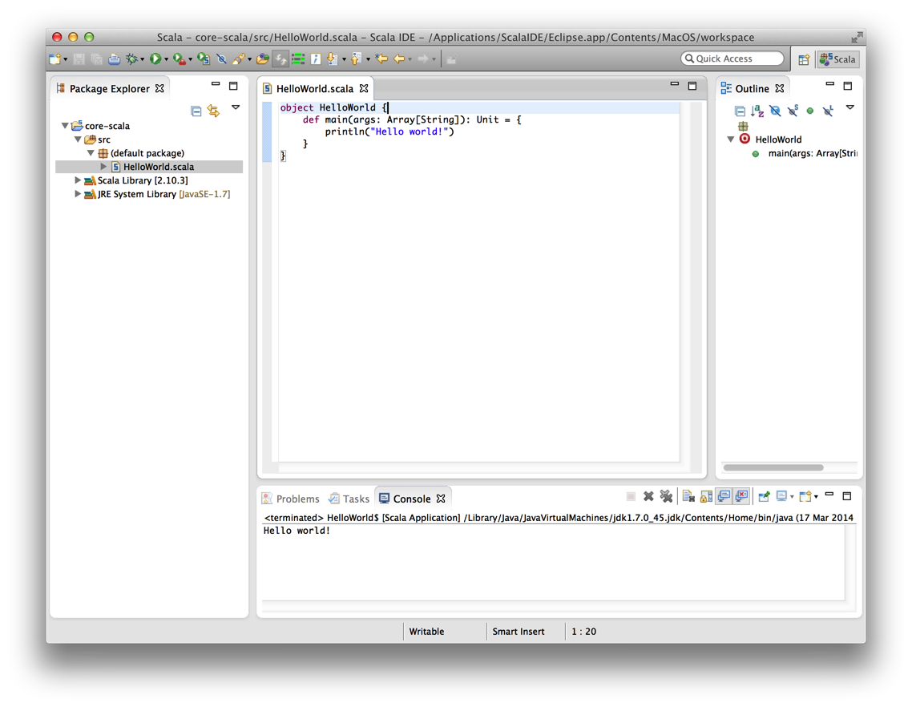
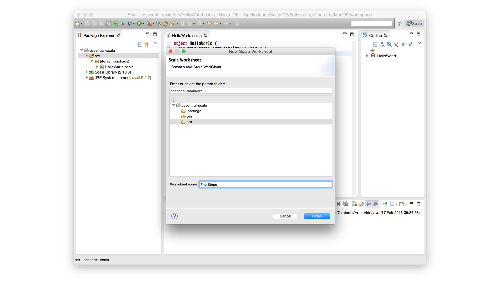
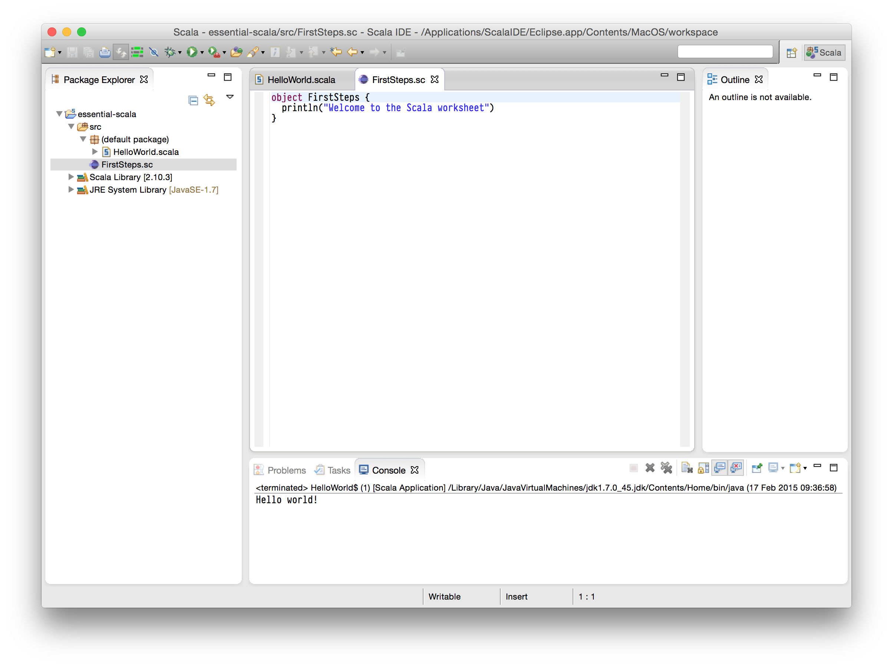

Throughout this course we will be working with short examples of Scala code using the *Scala Worksheets* feature of the *[Scala IDE for Eclipse]*, or *Scala IDE* for short. You should install this before starting the course.

[Scala IDE for Eclipse]: http://scala-ide.org

## Setting up Scala IDE

Scala IDE is a plugin that adds Scala language support to [Eclipse](http://eclipse.org). A complete version of Scala IDE with Eclipse is also available as a standalone bundle from [http://scala-ide.org](). This is the easiest way to install the software so we recommend you install the standalone bundle for this course.

Go to [http://scala-ide.org]() now, click the **Get the Bundle** button, and follow the on-screen instructions to download Scala IDE for your operating system:

Once you have downloaded and uncompressed the bundle you should find an application called **Eclipse**. Launch this. You will be asked to choose a folder for your *workspace*:

Accept the default location and you will see an empty main Eclipse window:

## Creating your first Scala application

Your *Eclipse workspace* is two things: a folder containing files and settings, and a main window where you will be doing most of your Scala programming. In your workspace you can will *projects* for each Scala application you work on.

Let's create a project for this course now. Select the **File menu** and choose **New > Scala Project**:

Enter a **Project name** of `core-scala` and click **Finish**. The tree view on the left of your workspace should now contain an empty project:

A project is no good without code to run! Let's create our first simple Scala application - the obligatory *Hello World* app. Select the **File Menu** and choose **New > Scala Object**:

**Name** your object `HelloWorld` and click **Finish**. A new file called `HelloWorld.scala` should appear in the tree view on the left of the main window. Eclipse should open the new file in the main editor ready for you to start coding:

The content of the file should read as follows:

~~~scala
object HelloWorld {

}
~~~

Replace this text with the following minimalist application:

~~~scala
object HelloWorld {
  def main(args: Array[String]): Unit = {
    println("Hello world!")
  }
}
~~~

Select the **Run Menu** and choose **Run**. This should execute the code in your application, resulting in the words `Hello world!` appearing in the *Console* pane at the bottom of the window. Congratulations - you just ran your first Scala application!

**Java tip:** Developers with Java experience will notice the resemblance of the code above to the Java hello world app:

~~~java
public class HelloWorld {
  public static void main(String[] args) {
    System.out.println("Hello world!");
  }
}
~~~

The resemblance is, of course, no coincidence. These two applications compile to more or less the same bytecode and have exactly the same semantics. We will learn much more about the similarities and differences between Scala and Java as the course continues.

## Creating your first Scala Worksheet

Compiling and running code whenever you make a change is a time consuming process that isn't particularly suitable to a learning environment.

Fortunately, Scala IDE allows us to create special files called *Scala Worksheets* that are specifically designed for training and experimentation. Every time you save a Worksheet, Eclipse automatically compiles and runs your code and displays the output on the right-hand side of your editor. This provides instant feedback, which is exactly what we need when investigating new concepts!

Create your first Scala Worksheet by selecting the **File Menu** and choosing **New > Scala Worksheet**:

Enter a **Worksheet name** of `FirstSteps` and click **Finish**. A new file called `FirstSteps.sc` should appear in the tree view on the left of the main window, and should open it in the main editor in the middle:

Note that the object on the left contains a single line of Scala code:

~~~scala
println("Welcome to the Scala worksheet")
~~~

for which Eclipse is displaying the corresponding output on the right:

~~~
Welcome to the Scala worksheet
~~~

Any expression you add to the left of the editor is evaluated and printed on the right. To demonstrate this, change the text in the editor to the following:

~~~scala
object FirstSteps {
  println("Welcome to the Scala worksheet")

  1 + 1

  if(20 > 10) "left" else "right"

  println("The ultimate answer is " + 42)
}
~~~

Save your work by selecting the **File Menu** and choosing **Save** (or better still by pressing **Ctrl+S**). Eclipse should automatically evaluate each line of code and print the results on the right of the editor:

~~~scala
object FirstSteps {
  println("Welcome to the Scala worksheet")   //> Welcome to the Scala worksheet

  1 + 1                                       //> res0: Int(2) = 2

  if(20 > 10) "left" else "right"             //> res1: String = left

  println("The ultimate answer is " + 42)     //> The ultimate answer is 42
}
~~~

We'll dive into what all of the text on the right means as we proceed with the course ahead. For now you're all set to start honing your Scala skills!
