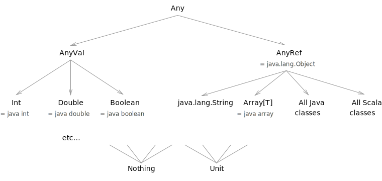

So far we have seen a lot to do with Scala's *classes*. Classes provide us with a way to **abstract over objects** that have similar properties, allowing us to write code that works with any object in a class.

Now let's explore how we can **abstract over classes**, allowing us to write code that works with objects of different classes. We'll start by looking at **traits**, Scala's building blocks for creating classes.

## Traits

Like a class, a trait is a named set of field and method definitions. However, it differs from a class in a few important ways:

 - **A trait cannot have a constructor** -- we can't create objects directly from a trait. Instead we use one or more traits to create a class, and then create objects from that class.

   We can base as many classes as we like on a trait, and combine as many traits as we like to create a class.

 - Traits can define **abstract fields and methods** that have names and type signatures but no implementations. We must specify the implementation by the time we create a class from the trait, but until that point we're free to leave definitions abstract.

For example, we can use traits to model visitors to a web site:

~~~ scala
import java.util.Date

trait Visitor {
  def id: String      // Unique id assigned to each user
  def createdAt: Date // Date this user first visited the site

  // How long has this visitor been around?
  def age: Long = new Date().getTime - createdAt.getTime
}

case class Anonymous(val id: String) extends Visitor {
  val createdAt = new Date()
}

case class User(
  val id: String,
  val createdAt: Date = new Date(),
  val email: String
) extends Visitor
~~~

The trait `Visitor` prescribes two abstract methods: `id` and `createdAt`. It also defines a concrete method, `age`, that is defined in terms of one of the abstract methods.

`Visitor` is used as a building block for two classes: `Anonymous` and `User`. Each class `extends Visitor`, meaning it inherits all of its fields and methods:

~~~ scala
scala> Anonymous("anon1")
res14: Anonymous = Anonymous(anon1)

scala> res14.createdAt
res15: java.util.Date = Mon Mar 24 15:11:45 GMT 2014

scala> res14.age
res16: Long = 8871
~~~

`id` and `createdAt` are abstract so they must be defined in the class to satisfy the compiler. Our classes implement them as `vals` rather than `defs`. This is legal in Scala, which sees `def` as more general version of `val`[^uap]. It is good practice to always define abstract members using `def` unless we specifically want to restrict them to being fields.

The `extends` keyword can be used to extend classes as well as traits. When we do this we need to specify the parameters of the super-constructor in the definition:

~~~ scala
class Administrator(
  id: String,
  createdAt: Date = new Date(),
  email: String
) extends User(id, createdAt, email)
~~~

**Warning:** It is inadvisable to extend a case class to create another case class. The implementation of case classes relies on details like the number of fields -- modifying the structure in a subclass can lead to bugs in things like pattern matching.

It is best practice to only create case classes as leaves of a type hierarchy. If we do have to extend a `case class`, we should always make the subtype a regular `class` and define the extra methods ourselves.

[^uap]: This is all part of the [uniform access principle] we saw in the exercises for [Object Literals](object-literals.html).

[uniform access principle]: http://en.wikipedia.org/wiki/Uniform_access_principle

## Subtyping and Polymorphism

A trait is a type just like a class. A class that extends a trait is a *subtype* of that trait, and any object of that class is both a value of the subtype and a value of the supertype. This is a kind of [polymorphism](http://en.wikipedia.org/wiki/Polymorphism_(computer_science)), and is essentially the polymorphism we get from Java.

Anywhere in our code that we expect an instance of the supertype, we can use an instance of the subtype instead. For example, we can assign `User` to a variable of type `Visitor` or pass it to a method that expects a `Visitor` as a parameter:

~~~ scala
scala> val visitor: Visitor = User("a", "me@example.com")
visitor: Visitor = User(a,me@example.com,Fri Feb 14 12:05:25 GMT 2014)

scala> def ageString(v: Visitor) =
     |   v.id + " is " + v.age + "ms old"
ageString: (v: Visitor)String

scala> ageString(User("a", "me@example.com"))
res14: String = a is 0ms old
~~~

## Scala's Type Hierarchy

Unlike Java, which separates primitive and object types, everything in Scala is an object. As a result, "primitive" value types like `Int` and `Boolean` form part of the same type hierarchy as classes and traits.

Scala has a grand supertype called `Any`, under which there are two types, `AnyVal` and `AnyRef`. `AnyVal` is the supertype of all value types, which `AnyRef` is the supertype of all "reference types" or classes. All Scala and Java classes are subtypes of `AnyRef`.

Some of these types are simply Scala aliases for types that exist in Java: `Int` is `int`, `Boolean` is `boolean`, and `AnyRef` is `java.lang.Object`.

There are also two special types at the *bottom* of the hierarchy. `Nothing` is the type of `throw` expressions, and `Unit` is Scala's equivalent of `void`. It might seem odd that these are subtypes of everything else -- this unique property (that we cannot recreate in our own classes) is what allows us to write expressions like the following:

~~~ scala
scala> if(true) {
     |   123
     | } else {
     |   // Nothing is a subtype of Int, so the `if` is an Int overall:
     |   throw new Exception("division by zero")
     | }
res2: Int = 123
~~~

## Exploiting Types

In one sense a type is just a collection of values that share common properties. More than that, though, a type can represent **any property of a program that we can establish without evaluating it.**

In old languages like C, types were used to specify the machine representation of data, essentially providing optimisation hints to the compiler. In modern languages like Scala, **types are used to ensure that important program properties are maintained**.

A good Scala developer uses types to his or her advantage to avoid bugs and write self-documenting code.

## Exercises

### Shaping up with traits

Define a trait called `Shape` and give it three abstract methods:

 - `sides` returns the number of sides;
 - `perimeter` returns the total length of the sides;
 - `area` returns the area.

Implement `Shape` with three classes: `Circle`, `Rectangle`, and `Square`. In each case provide implementations of each of the three methods. Ensure that the main constructor parameters of each shape (e.g. the radius of the circle) are accessible as fields.

**Tip:** The value of &pi; is accessible as `math.Pi`.

~~~ scala
trait Shape {
  def sides: Int
  def perimeter: Double
  def area: Double
}

case class Circle(radius: Double) extends Shape {
  val sides = 1
  val perimeter = 2 * math.Pi * radius
  val area = math.Pi * radius * radius
}

case class Rectangle(width: Double, height: Double) extends Shape {
  val sides = 4
  val perimeter = 2 * width + 2 * height
  val area = width * height
}

case class Square(size: Double) extends Shape {
  val sides = 4
  val perimeter = 4 * size
  val area = size * size
}
~~~

### Shaping up 2

The solution from the last exercise delivered three distinct types of shape. However, it doesn't model the relationships between the three correctly. A `Square` isn't just a `Shape` -- it's also a type of `Rectangle` where the width and height are the same.

We want to avoid case-class-to-case-class inheritance, so refactor the solution to the last exercise so that `Square` and `Rectangle` are subtypes of a common type `Rectangular`.

The new code looks like this:

~~~ scala
// trait Shape ...

// case class Circle ...

trait Rectangular extends Shape {
  def width: Int
  def height: Int
  val sides = 4
  val perimeter = 2*width + 2*height
  val area = width*height
}

case class Square(val size: Int) extends Rectangular {
  val width = size
  val height = size
}

case class Rectangle(val width: Int, val height: Int) extends Rectangular
~~~

